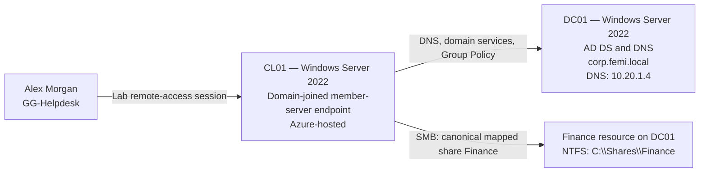

# Environment architecture

[Back to README](../README.md)

## Logical topology

This is a logical diagram, not an Azure network deployment diagram. The repository does not contain a complete VNet/subnet or firewall inventory. The SMB arrow identifies the resource used; it does not assert the original share's exact local target.

## Hosts and directory

| Item | Configuration |
| --- | --- |
| DC01 | Windows Server 2022 domain controller; NTDS and DNS running in saved output |
| CL01 | Windows Server 2022 member server used as the domain-joined client endpoint |
| Domain / NetBIOS name | `corp.femi.local` / `CORP` |
| DC01 DNS address | `10.20.1.4`, shown in the recovered DNS/DC-discovery test |
| Domain and forest functional levels | Windows Server 2016 in saved output; distinct from the installed OS version |
| Canonical mapped-drive path | `\\DC01\Finance`, configured for `F:` in Group Policy Preferences per lab-author confirmation |
| Finance NTFS location | `C:\Shares\Finance` |

## Corporate OU organization

The saved ADUC view shows a `CORP` OU containing Computers, Groups, Servers, Service Accounts, and Users. The Users OU contains Executive, Finance, HR, IT, Operations, and Sales departments.

CL01's workstation organization is part of the reported lab configuration. The saved policy output confirms application of `GPO-Workstations-Baseline`; it does not show CL01's exact OU distinguished name or the GPO link location.

## Access design

The saved Finance chain is:

`Ethan Walker → GG-Finance → DL-Finance-Share-RW → NTFS Modify`

Alex's captured session includes `GG-Helpdesk` and Remote Desktop Users, with no Domain Admins entry. The exact OU delegation ACL is not included in the evidence.

See [implementation](../docs/implementation.md) and [validation](../docs/validation.md) for permission details and the secondary Finance share test.
